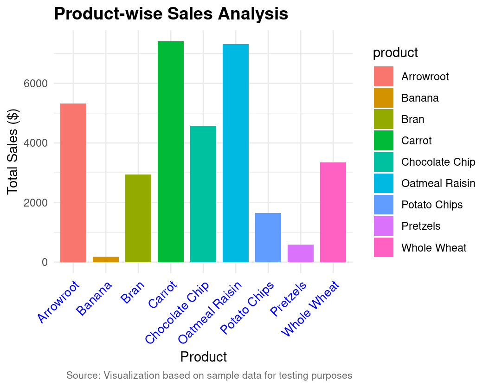
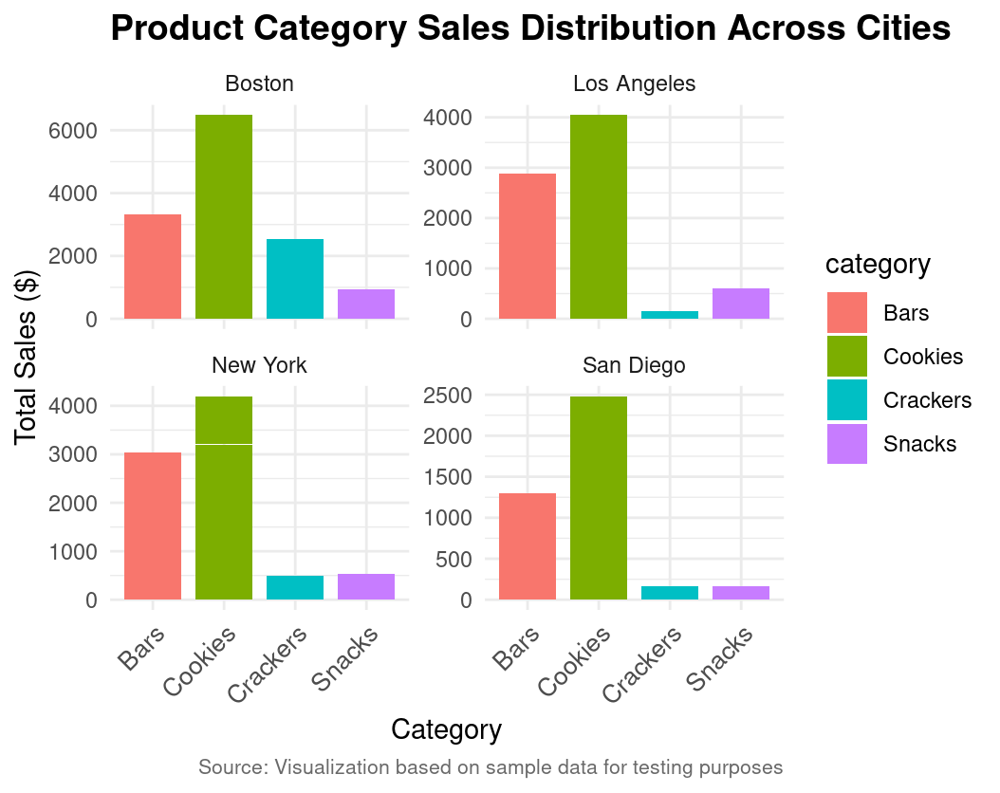
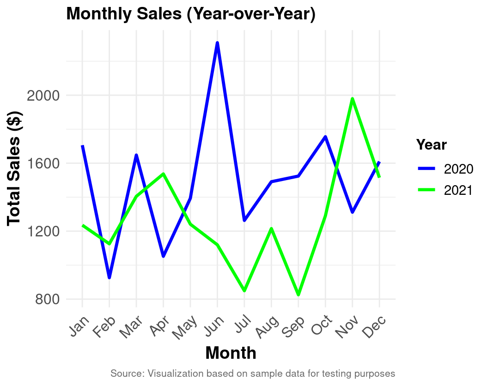
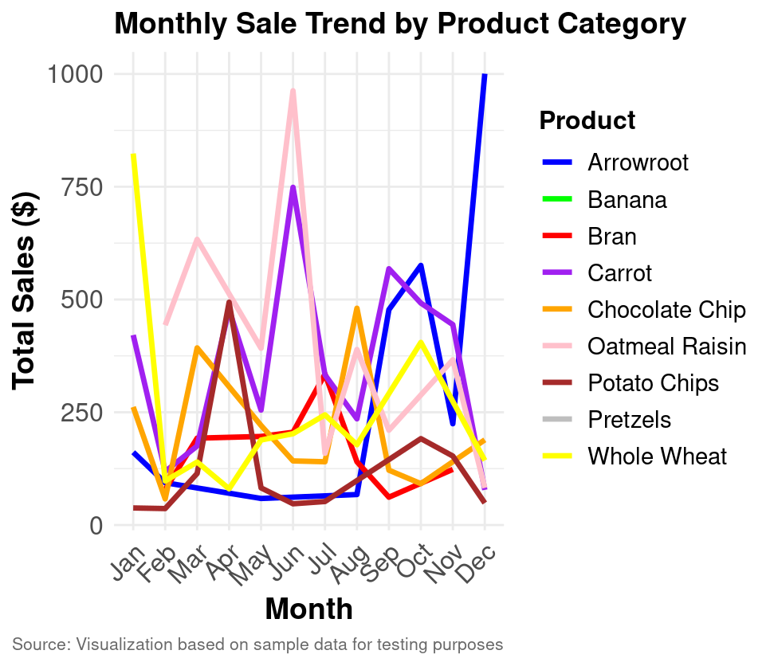
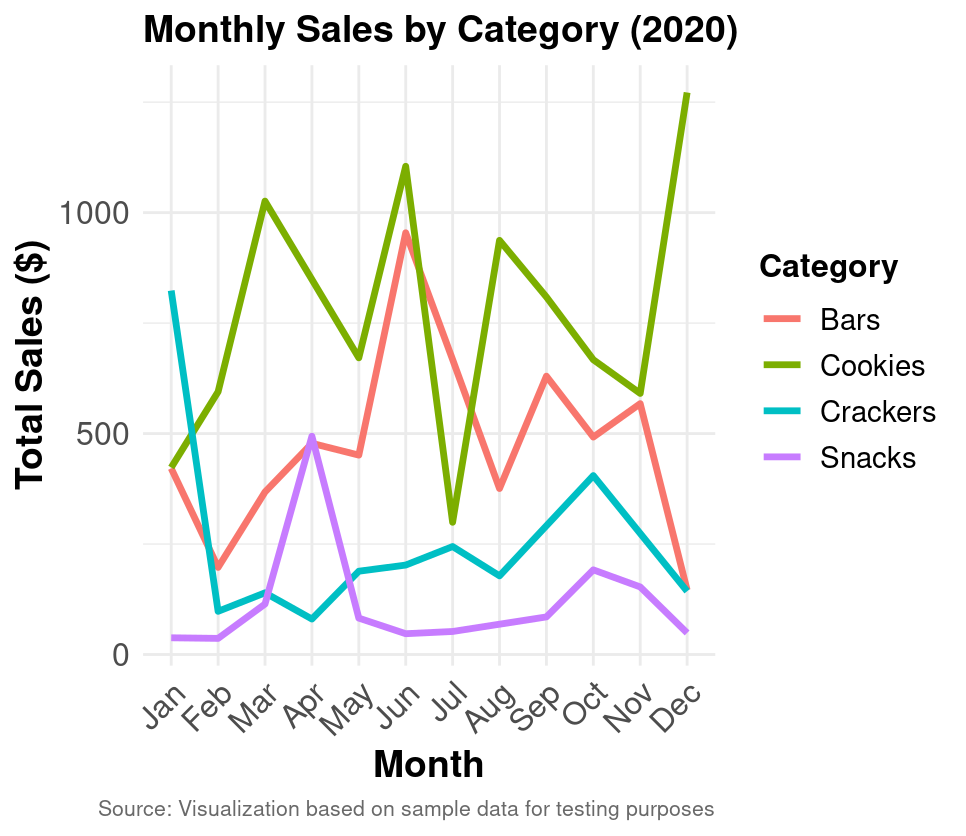
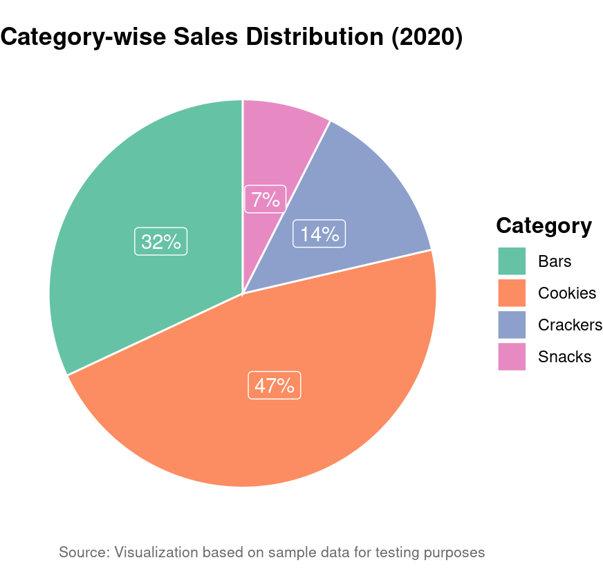

# Case Study: Food_Sales_Analysis with R

# Introduction
This repository presents a detailed case study on a food sales company. Using data from 2020 and 2021, the analysis explores sales performance across various products, categories, and cities, including items such as cookies, bars, crackers, and snacks. By leveraging R programming, this study aims to uncover actionable insights to optimize product offerings and improve sales strategies.

## 📕 Table Of Contents
* [SCENARIO](#scenario)
* [ASK](#ask)
* [PREPARE](#prepare)
* [PROCESS](#process)
* [ANALYZE](#analyze)
* [ACT](#act)

## SCENARIO

A food sales company wants to analyze its sales data from 2020 and 2021 to gain insights into the performance of various products, categories, and cities, including items like cookies, bars, crackers, and snacks. Using this information, the company aims to identify key trends and develop high-level recommendations to optimize product offerings and enhance sales and marketing strategies.

## Phase 1: ASK

Business Tasks
Key business questions to guide the analysis:
> 1. Which product categories and specific products are driving the most sales?
> 2. How do sales vary across different cities?
> 3. What are the sales trends over time in 2020 and 2021?
> 4. Are there any seasonal patterns in sales?.

## Phase 2: PREPARE

This phase focuses on setting up the environment and exploring the dataset to ensure a thorough analysis.

**Evaluating Data Validity**:

The food sales dataset undergoes a quality assessment to provide a clear snapshot of sales performance across various products, cities, and categories, offering both high-level summaries and detailed views of sales during the 2020-2021 timeframe.
> 1. Reliability: The analysis is based on a simulated dataset containing 244 sales records from 2020-2021, representing multiple cities and product categories.
> 2. Originality: Although the data is artificially generated for educational purposes, it facilitates an in-depth examination of sales trends across products, categories, and geographic regions.
> 3. Comprehensiveness: Robust statistical techniques in R are used to explore sales patterns, uncovering insights into product performance, seasonal trends, and market segmentation.
> 4. Currency: The dataset focuses on sales data from 2020-2021.
> 5. Limitations: As the dataset is simulated and covers a limited timeframe, its primary purpose is to serve as a learning tool rather than a definitive source for business decision-making.

**Install and load packages to setup the environment**: 
The data is imported from an excel document into a dataframe called foodsales.

**Data Import and Setup**
```r
install.packages("readxl")
library(readxl)
foodsales <- read_excel("Food_Sales_Analysis.xlsx")
install.packages("tidyverse")
library(tidyverse)
library(dplyr)
library(ggplot2)
install.packages("janitor")
library(janitor)
library(dplyr)
library(tidyr)
library(lubridate)
```
```r
── Attaching core tidyverse packages ──────────────── tidyverse 2.0.0 ──
✔ dplyr     1.1.4     ✔ readr     2.1.5
✔ forcats   1.0.0     ✔ stringr   1.5.1
✔ ggplot2   3.5.1     ✔ tibble    3.2.1
✔ lubridate 1.9.4     ✔ tidyr     1.3.1
✔ purrr     1.0.2     
── Conflicts ────────────────────────────────── tidyverse_conflicts() ──
✖ dplyr::filter() masks stats::filter()
✖ dplyr::lag()    masks stats::lag()
ℹ Use the conflicted package to force all conflicts to become errors

Attaching package: ‘janitor’

The following objects are masked from ‘package:stats’:

    chisq.test, fisher.test
```
## Phase 3: PROCESS
We need to verify the column names first to ensure consistency, as all column names must match exactly.
```r
head(foodsales) #Views the first 6 rows
```
```r
# A tibble: 6 × 8
  OrderDate           Region City    Category Product Quantity UnitPrice
  <dttm>              <chr>  <chr>   <chr>    <chr>      <dbl>     <dbl>
1 2020-01-01 00:00:00 East   Boston  Bars     Carrot        33      1.77
2 2020-01-04 00:00:00 East   Boston  Crackers Whole …       87      3.49
3 2020-01-07 00:00:00 West   Los An… Cookies  Chocol…       58      1.87
4 2020-01-10 00:00:00 East   New Yo… Cookies  Chocol…       82      1.87
5 2020-01-13 00:00:00 East   Boston  Cookies  Arrowr…       38      2.18
6 2020-01-16 00:00:00 East   Boston  Bars     Carrot        54      1.77
# ℹ 1 more variable: TotalPrice <dbl>
```
```r
slice(foodsales,1:10) #Views the first 10 rows
```
```r
# A tibble: 10 × 8
   OrderDate           Region City   Category Product Quantity UnitPrice
   <dttm>              <chr>  <chr>  <chr>    <chr>      <dbl>     <dbl>
 1 2020-01-01 00:00:00 East   Boston Bars     Carrot        33      1.77
 2 2020-01-04 00:00:00 East   Boston Crackers Whole …       87      3.49
 3 2020-01-07 00:00:00 West   Los A… Cookies  Chocol…       58      1.87
 4 2020-01-10 00:00:00 East   New Y… Cookies  Chocol…       82      1.87
 5 2020-01-13 00:00:00 East   Boston Cookies  Arrowr…       38      2.18
 6 2020-01-16 00:00:00 East   Boston Bars     Carrot        54      1.77
 7 2020-01-19 00:00:00 East   Boston Crackers Whole …      149      3.49
 8 2020-01-22 00:00:00 West   Los A… Bars     Carrot        51      1.77
 9 2020-01-25 00:00:00 East   New Y… Bars     Carrot       100      1.77
10 2020-01-28 00:00:00 East   New Y… Snacks   Potato…       28      1.35
# ℹ 1 more variable: TotalPrice <dbl>
```
```r
colnames(foodsales) #Checks the column name headers
```
```r
[1] "OrderDate"  "Region"     "City"       "Category"   "Product"   
[6] "Quantity"   "UnitPrice"  "TotalPrice"
```
```r
str(foodsales) #Checks the data types for the data
```
```r
tibble [244 × 8] (S3: tbl_df/tbl/data.frame)
 $ OrderDate : POSIXct[1:244], format: "2020-01-01" ...
 $ Region    : chr [1:244] "East" "East" "West" "East" ...
 $ City      : chr [1:244] "Boston" "Boston" "Los Angeles" "New York" ...
 $ Category  : chr [1:244] "Bars" "Crackers" "Cookies" "Cookies" ...
 $ Product   : chr [1:244] "Carrot" "Whole Wheat" "Chocolate Chip" "Chocolate Chip" ...
 $ Quantity  : num [1:244] 33 87 58 82 38 54 149 51 100 28 ...
 $ UnitPrice : num [1:244] 1.77 3.49 1.87 1.87 2.18 1.77 3.49 1.77 1.77 1.35 ...
 $ TotalPrice: num [1:244] 58.4 303.6 108.5 153.3 82.8 ...
```
**Clean Data**: To ensure data quality and consistency, we'll clean and tidy the datasets. This involves handling missing values, outliers, and inconsistencies in data formats.

**Clean the column names and check if all data types are correct.**

```r
my_sales_clean_data <- clean_names(foodsales) # Clean the column names
```
```r
colnames(my_sales_clean_data)  # View the cleaned column names 
```
```r
[1] "order_date"  "region"      "city"        "category"   
[5] "product"     "quantity"    "unit_price"  "total_price"
```
```r
sum(is.na(my_sales_clean_data)) # Total NA values 

[1] 0 # output
```
```r
my_sales_clean_data <- na.omit(my_sales_clean_data) 
```
```r
glimpse(my_sales_clean_data)
```
```r
Rows: 244
Columns: 8
$ order_date  <dttm> 2020-01-01, 2020-01-04, 2020-01-07, 2020-01-10, 2…
$ region      <chr> "East", "East", "West", "East", "East", "East", "E…
$ city        <chr> "Boston", "Boston", "Los Angeles", "New York", "Bo…
$ category    <chr> "Bars", "Crackers", "Cookies", "Cookies", "Cookies…
$ product     <chr> "Carrot", "Whole Wheat", "Chocolate Chip", "Chocol…
$ quantity    <dbl> 33, 87, 58, 82, 38, 54, 149, 51, 100, 28, 36, 31, …
$ unit_price  <dbl> 1.77, 3.49, 1.87, 1.87, 2.18, 1.77, 3.49, 1.77, 1.…
$ total_price <dbl> 58.41, 303.63, 108.46, 153.34, 82.84, 95.58, 520.0…
```
## Phase 4: Analyze
After completing cleaning and formatting, we can now explore the data from a broader perspective. By generating high-level summary statistics, we aim to conduct a descriptive analysis to identify sales data patterns and trends by category, product, and date.

**View Sales By Category (Here we do some analysis to check which categories had the most sales)**
```r
my_sales_clean_data %>%
  select(city, category, product,order_date, quantity, unit_price, total_price) %>%
  group_by(category) %>%
summarise( total_sales_by_category = sum(total_price)) %>%
arrange(desc(total_sales_by_category))
```
```r
# A tibble: 4 × 2
  category total_sales_by_category
  <chr>                      <dbl>
1 Cookies                   17212.
2 Bars                      10536.
3 Crackers                   3340.
4 Snacks                     2238.
```
**Finding**: **Analysis of Sales By Category**
> 1. The analysis of total sales by category reveals that cookies are the highest-performing product category, contributing significantly to overall sales with 17,212 units sold.
> 2. Bars follow with 10,536 units, while crackers and snacks show relatively lower sales figures of 3,340 and 2,238 units, respectively. 
This indicates a strong customer preference for cookies and bars compared to other product categories.

**View Sales By Product (Here we do some analysis to check which products had the most sales)**
```r
 my_sales_clean_data %>%
  select(city, category, product,order_date, quantity, unit_price, total_price) %>%
  group_by(product) %>%
summarise( total_sales_by_product = sum(total_price)) %>%
arrange(desc(total_sales_by_product))
```
```r
# A tibble: 9 × 2
  product        total_sales_by_product
  <chr>                           <dbl>
1 Carrot                          7411.
2 Oatmeal Raisin                  7310.
3 Arrowroot                       5330.
4 Chocolate Chip                  4572.
5 Whole Wheat                     3340.
6 Bran                            2945.
7 Potato Chips                    1652.
8 Pretzels                         586.
9 Banana                           179.
```
**Finding**: **Analysis of Sales By Product**
> 1. The analysis of total sales by product shows that Carrot and Oatmeal Raisin are the top-performing products, with 7,411 and 7,310 units sold, respectively. 
> 2. Arrowroot and Chocolate Chip follow with 5,330 and 4,572 units. In contrast, Banana and Pretzels have the lowest sales, with just 179 and 586 units sold, respectively. 

This indicates a strong preference for baked goods like Carrot and Oatmeal Raisin over snack items like Pretzels and Banana.

**View Sales By Order date (Here, we perform an analysis to identify which products had the highest sales during a specific period. The lubridate library is utilized to extract the year and month from the dataset.)**

```r
my_sales_clean_data %>%
  mutate(month_name = month(order_date, label = TRUE)) %>%
  mutate(saleyear = year(order_date)) %>%
  group_by(saleyear, month_name) %>%
  summarise(total_sales_by_product = sum(total_price), .groups = "drop") %>%
  arrange(desc(saleyear), desc(month_name))
```
```r
# A tibble: 24 × 3
   saleyear month_name total_sales_by_product
      <dbl> <ord>                       <dbl>
 1     2021 Dec                         1515.
 2     2021 Nov                         1979.
 3     2021 Oct                         1290.
 4     2021 Sep                          826.
 5     2021 Aug                         1215.
 6     2021 Jul                          849.
 7     2021 Jun                         1119.
 8     2021 May                         1241.
 9     2021 Apr                         1537.
10     2021 Mar                         1405.
# ℹ 14 more rows
# ℹ Use `print(n = ...)` to see more rows
```
**Finding**: **Analysis of Monthly Sales by Year (2021)**
> 1. Peak Sales Month:
        December 2021 recorded the highest sales with 1,515 units, indicating strong performance, likely influenced by holiday shopping trends.

> 2. Consistent High Sales Periods:
        Sales remained relatively high during April (1,537 units), March (1,405 units), and November (1,979 units), showing consistent demand during these months.

> 3. Lower Sales Periods:
        The lowest sales occurred in September (826 units) and July (849 units), potentially due to seasonal variations or lower consumer demand during those months.

> 4. Seasonal Trends:
        Sales appear to fluctuate across the year, with peaks in holiday seasons and dips during mid-year. This suggests seasonality plays a significant role in sales performance.

> 5. Strategic Insight:
        Marketing efforts and promotions could be focused on periods with historically lower sales (e.g., July and September) to boost performance.
        December's high sales highlight the importance of capitalizing on the holiday season with targeted campaigns and sufficient stock.

**View Sales By Order date(2020 sales)**       
```r
my_sales_clean_data %>%
  mutate(month_name = month(order_date, label = TRUE)) %>%
  mutate(saleyear = year(order_date)) %>%
  filter(saleyear == 2020) %>%
 group_by(month_name) %>%
   summarise( total_sales_by_date = sum(total_price)) %>%
	arrange(desc(total_sales_by_date))
```
```r
# A tibble: 12 × 2
   month_name total_sales_by_date
   <ord>                    <dbl>
 1 Jun                      2309.
 2 Oct                      1756.
 3 Jan                      1706.
 4 Mar                      1648.
 5 Dec                      1610.
 6 Sep                      1524.
 7 Aug                      1491.
 8 May                      1393.
 9 Nov                      1311.
10 Jul                      1263.
11 Apr                      1052.
12 Feb                       926.
```
**Finding**:**Analysis of Total Sales by Month**

> 1. Top-Performing Month:
        June recorded the highest sales at 2,309 units, indicating strong consumer demand during this period.

> 2. Other High Sales Months:
        October (1,756 units) and January (1,706 units) follow, reflecting consistent performance, possibly due to seasonal trends or promotional campaigns during the New Year.

> 3. Moderate Sales Periods:
        March (1,648 units), December (1,610 units), and September (1,524 units) show steady sales activity, with December potentially benefiting from holiday shopping.

> 4. Lowest Sales Months:
        February had the lowest sales at 926 units, followed by April (1,052 units) and July (1,263 units), suggesting potential dips in consumer activity during these months.

> 5. Seasonal Trends:
        Sales are relatively strong in mid-year (June) and early-year (January), while there are notable drops in February and April.
        
**View Sales By Order date(2021 sales)**
```r
 my_sales_clean_data %>%
  select(city, category, product, order_date, quantity, unit_price, total_price) %>%
  group_by(category) %>%
  summarise(total_sales_by_category = sum(total_price, na.rm = TRUE)) %>%
  arrange(desc(total_sales_by_category))
```
```r
# A tibble: 4 × 2
  category total_sales_by_category
  <chr>                      <dbl>
1 Cookies                   17212.
2 Bars                      10536.
3 Crackers                   3340.
4 Snacks                     2238.
```
**Finding**: **Analysis of Total Sales by Category**:
> 1. Cookies dominate sales with 17,212 units, accounting for the largest share, followed by Bars at 10,536 units. 

> 2. Crackers and Snacks contribute significantly less, with 3,340 units and 2,238 units, respectively. 

This highlights strong customer preference for Cookies and Bars, suggesting they should be prioritized in marketing and inventory strategies.

## Phase 5: Share

We'll begin by analyzing the data through visualizations to uncover key insights and present our findings in a clear and impactful manner to the marketing team and other stakeholders.

**1.Sales by Product**
```r
ggplot(data = my_sales_clean_data, aes(x = product, y = total_price, fill = product)) +
  geom_col(width = 0.8) + 
  theme_minimal() +  
  theme(
    axis.text.x = element_text(angle = 45, hjust = 1, colour = "blue", size = 10),  
    plot.title = element_text(face = "bold", size = 14),  
    plot.caption = element_text(size = 8, color = "dim gray")
  ) +
  labs(
    title = "Product-wise Sales Analysis",
    caption = "Source: Visualization based on sample data for testing purposes",
    x = "Product",
    y = "Total Sales ($)"
  )

```


Looking at the product-level sales data, here are the key insights:

> 1. Carrot and Oatmeal Raisin products are the top performers, each with approximately 7,000 sales units, suggesting a strong consumer preference for these flavors.
> 2. Arrowroot is the third-best seller with around 5,000 units, performing notably well for a less common flavor.
> 3. Chocolate Chip shows solid performance with roughly 4,500 units, aligning with typical consumer preferences for chocolate products.
There's a significant drop in sales volume between the top performers and lower-selling products like Potato Chips and Pretzels, which barely reach 2,000 units.
> 4. Banana has the lowest sales volume of all products, suggesting it might be worth reconsidering its place in the product lineup.

**Recommendations**:
> 1. A key recommendation would be to investigate what makes Carrot and Oatmeal Raisin products so successful - whether it's marketing, pricing, placement, or product quality - and apply those learnings to boost performance of lower-selling items. 
> 2. Additionally, given Banana's poor performance, resources might be better allocated to expanding successful product lines or developing new flavors based on the top performers' characteristics.

**2. Sales by City by Category (wrap)**
```r
ggplot(data = my_sales_clean_data) +
  geom_col(aes(x = category, y = total_price, fill = category), width = 0.8) + 
  facet_wrap(~city, scales = "free_y") +  
  theme_minimal() +  
  theme(
    axis.text.x = element_text(angle = 45, hjust = 1, size = 10),  
    plot.title = element_text(face = "bold", size = 14), 
    plot.caption = element_text(size = 8, color = "dim gray")  
  ) +
  labs(
    title = "Product Category Sales Distribution Across Cities",
    caption = "Source: Visualization based on sample data for testing purposes",
    x = "Category",
    y = "Total Sales ($)"
  )
```


Based on the sales data visualization across four major cities, here are the key insights:

> 1. Cookies are consistently the best-selling category across all cities, with Boston showing the highest cookie sales at approximately 6,000 units.

> 2. Bars are the second most popular category, with relatively consistent sales across cities (ranging from about 1,500 to 3,500 units).

> 3. Boston appears to be the strongest market overall, showing higher sales volumes across most categories, particularly in cookies and crackers.

> 4. Los Angeles and San Diego show similar sales patterns but at different scales, with Los Angeles having higher overall volumes.

> 5. Crackers and Snacks are the lowest-performing categories in all cities, with particularly low sales in Los Angeles and San Diego.

**Recommendations**
A potential opportunity would be to investigate why the West Coast cities (Los Angeles and San Diego) have significantly lower cracker sales compared to Boston, and whether there are regional preferences that could inform product strategy.

**3. Sales by Order date**:
```r
my_sales_clean_data %>%
  mutate(month_name = month(order_date, label = TRUE), saleyear = year(order_date)) %>%
  group_by(saleyear, month_name) %>%
  summarise(total_sales_by_date = sum(total_price)) %>%
  ggplot(aes(x = month_name, y = total_sales_by_date, color = factor(saleyear), group = factor(saleyear))) +
  geom_line(size = 1.2) + 
  scale_color_manual(values = c("blue", "green", "red", "purple", "orange")) +  
  theme_minimal() +  # Use minimal theme for a cleaner look
  theme(
    axis.text.x = element_text(angle = 45,size = 12, hjust = 1),
    axis.text.y = element_text(size = 12),
    axis.title = element_text(size = 14, face = "bold"),
    legend.title = element_text(size = 12, face = "bold"),
    legend.text = element_text(size = 11),
    plot.title = element_text(size = 14, face = "bold"),
    plot.caption = element_text(size = 8,color = "dim gray")
  ) +
  labs(
    title = "Monthly Sales (Year-over-Year)",
    caption = "Source: Visualization based on sample data for testing purposes",
    x = "Month",
    y = "Total Sales ($)"
  )+
  guides(color = guide_legend(title = "Year"))

```


Looking at the year-over-year monthly sales comparison between 2020 and 2021, here are the key insights:

>  Seasonal Patterns:
> 1. Both years show significant monthly fluctuations
> 2. Peak sales occurred in June 2020 ($2,400) and November 2021 ($2,000)
> 3. Both years tend to have lower sales in July-August period

> Year-over-Year Changes:
> 1. Sales patterns shifted significantly between 2020 and 2021
> 2. 2020 had a notable spike in June that wasn't repeated in 2021
> 3. 2021 showed stronger performance in Q4 (October-December) compared to 2020
> 4. Early months (January-March) were relatively stable across both years

>  Notable Trends:
> 1. 2020 showed more volatile sales patterns with sharp peaks and troughs
> 2. 2021 demonstrated more consistent sales levels, especially in the second half
> 3. The lowest sales point shifted from February 2020 to September 2021

**Recommendation**:
- The more constant trend in 2021 could be a sign of better inventory control or more persistent marketing initiatives.
- The change in the months with the highest sales indicates that resources must be allocated flexibly all year long
- Understanding the success factors behind the strong Q4 2021 performance could help in planning future strategies

**4. Month Sales By Product(2020)**
```r
my_sales_clean_data %>%
  mutate(month_name = month(order_date, label = TRUE), saleyear = year(order_date)) %>%
  filter(saleyear == 2020) %>%
  group_by(saleyear, month_name, product) %>%
  summarise(total_sales_by_date = sum(total_price)) %>%
  ggplot(aes(x = month_name, y = total_sales_by_date, color = product, group = product)) +
  geom_line(linewidth = 1.2) +  
  scale_color_manual(values = c("blue", "green", "red", "purple", "orange", "pink", "brown", "gray", "yellow" )) +  
  theme_minimal() +  
  theme(
    axis.text.x = element_text(angle = 45, size = 12, hjust = 1),  
    axis.text.y = element_text(size = 12), 
    axis.title = element_text(size = 14, face = "bold"),  
    legend.title = element_text(size = 12, face = "bold"),  
    legend.text = element_text(size = 11),  
    plot.title = element_text(size = 14, face = "bold"),  
    plot.caption = element_text(size = 8, color = "dim gray")  
  ) +
  labs(
    title = "Monthly Sale Trend by Product Category",
    caption = "Source: Visualization based on sample data for testing purposes",
    x = "Month",
    y = "Total Sales ($)"
  ) +
  guides(color = guide_legend(title = "Product"))

```


Looking at the monthly sales trends across product categories in 2020, here are the key insights:

> High Variability in Sales:
> 1. Certain product categories like "Arrowroot" and "Whole Wheat" show significant spikes in sales during specific months.
> - Products such as "Oatmeal Raisin" and "Potato Chips" maintain relatively steady, lower sales levels throughout the year.

>  Seasonal Trends:
> 1. There appears to be a sales peak for "Arrowroot" and "Carrot" in the later months (e.g., November and December), which could be attributed to seasonal demand or promotions.
> 2. Some products like "Chocolate Chip" and "Banana" experience fluctuations without a clear seasonal trend.

**Recommendations**:
- Focus on maximizing sales for high-performing products like "Arrowroot" and "Whole Wheat" during peak months with targeted promotions and sufficient stock. 
- Investigate seasonal spikes to replicate successful strategies across other products. 
- Revitalize low-performing items like "Pretzels" and "Potato Chips" through rebranding, bundling, or customer research. Optimize inventory and marketing efforts based on sales trends, and use digital campaigns to enhance product visibility and engagement.

**5. Month Sales By Category(multiple lines) (2020)**
```r
my_sales_clean_data %>%
  mutate(month_name = month(order_date, label = TRUE), saleyear = year(order_date)) %>%
  filter(saleyear == 2020) %>%
  group_by(month_name, category) %>%
  summarise(total_sales = sum(total_price), .groups = "drop") %>%
  ggplot(aes(x = month_name, y = total_sales, color = category, group = category)) +
  geom_line(linewidth = 1.2) +
  theme_minimal() +
  theme(
    axis.text.x = element_text(angle = 45, hjust = 1, size = 12), 
    axis.text.y = element_text(size = 12), 
    axis.title = element_text(size = 14, face = "bold"),  
    legend.title = element_text(size = 12, face = "bold"), 
    legend.text = element_text(size = 11), 
    plot.title = element_text(size = 14, face = "bold"), 
    plot.caption = element_text(size = 8, color = "dim gray")  
  ) +
  labs(
    title = "Monthly Sales by Category (2020)",
    caption = "Source: Visualization based on sample data for testing purposes",
    x = "Month",
    y = "Total Sales ($)",
    color = "Category"
  )
```


Looking at the monthly sales trends by product category for 2020, here are the key insights:

> Category Performance:
> 1.Cookies routinely generates revenue, peaking at over $1,000 in March and December
> 2. Bars shows steady performance as the second-best category, typically ranging between $400-$600
> 3. Crackers had a great start in January (around $800), but saw a big fall after that
> 4. Snacks have the lowest but most consistent sales, circling around $200

> Seasonal Patterns:
> 1. June sees a noticeable mid-year peak for the majority of categories.
> 2. Summertime (July–August) sales are lower in every category.
> 3. December's strong year-end results, especially for Cookies
> 4. Performance in all categories is moderate throughout the spring (March–April).

**Recommendations**:
1. Analyse the elements that contributed to Cookies' strong performance in order to see if they may be applied to other categories.
2. Explore the reasons for Crackers' dramatic decline after January
3. Consider seasonal promotions to boost the traditionally slower summer months
4. Create strategies to take advantage of the robust December sales period, especially for non-cookie categories.

**Month Sales By Category (Create monthly sales pie chart by category for 2020)**
```r
my_sales_clean_data %>%
  filter(year(order_date) == 2020) %>%
  group_by(category) %>%
  summarise(total_sales_by_cat = sum(total_price), .groups = "drop") %>%
  mutate(
    total_sales_by_cat_perc = total_sales_by_cat / sum(total_sales_by_cat),
    labels = percent(total_sales_by_cat_perc, accuracy = 1L)
  ) %>%
  ggplot(aes(x = "", y = total_sales_by_cat_perc, fill = category)) +
  geom_col(color = "white") +  
  geom_label(aes(label = labels), 
             color = "white", 
             position = position_stack(vjust = 0.5), 
             show.legend = FALSE) +
  coord_polar(theta = "y") +
  scale_fill_brewer(palette = "Set2") +  
  theme_void() +
  labs(title = "Category-wise Sales Distribution (2020)", 
  caption = "Source: Visualization based on sample data for testing purposes",
  fill = "Category") +
  theme(
    plot.title = element_text(face = "bold"), 
    legend.title = element_text(size = 12, face = "bold")
  )

```


Looking at the sales distribution by product category for 2020, here are the key insights:

>   Category Performance:
> 1. Cookies are the main product, making up 47.0% of all sales.  
> 2. Bars come in second with a good share of 32.0%.  
> 3. Crackers have a moderate share at 14.0% of sales.  
> 4. Snacks hold the smallest portion at 7.0% of total sales.

>  Category Balance:
> 1. Together, Cookies and Bars, which do best, make up 79.0% of total sales.  
> 2. Sales from Crackers and Snacks are only 21.0%, showing a chance for growth in these areas.
The difference between the top-performing item (cookies) and the lowest-performing one (snacks) is substantial.

**Recommendations:**  
1. Investigate success factors behind Cookies' dominance to replicate in other categories  
2. Boost Bars and Snacks with targeted product development and marketing  
3. Assess reliance on Cookies and diversify revenue streams  
4. Explore growth opportunities for Bars and Snacks through market research  
5. Optimize pricing strategies to maximize revenue across categories

## Phase 6: Act

In the final step of our data analysis, here are actionable recommendations to boost customer engagement and drive sales for the food company.

**Product Strategy**
In the final step of the data analysis process, we will provide recommendations to boost customer engagement and drive sales for the food company.

1. **Product Strategy**
   * Make the most of our strong 46.7% cookie market share by:
     - Understanding what makes our popular cookie varieties tick
     - Adding new flavors and package sizes to meet different needs
     - Looking at ways to use winning cookie recipes in other product types
   * Fix our snacks' 7.5% underperformance through:
     - Reformulating and innovating products
     - Research on consumer preferences
     - Competitive analysis in the snacks category
   * Review product portfolio optimization:
     - Consider consolidating low-performing SKUs
     - Analyse production costs to revenue contribution.
     - Test innovative product ideas in stronger categories.

2. **Category Management**
   * Strengthen category mix:
     - Create plans to increase the percentage of bars (13.9%) and snacks (7.5%).
     - Align resources between preserving Cookies' success and expanding other categories.
     - Make promotional calendars tailored to a particular category.
   * Cross-category initiatives:
     - Bundle products across categories
     - Design multi-category promotions with a theme.
     - Create cross-merchandising plans.

3. **Distribution Strategy**
   * Optimize channel performance:
     - Review distribution coverage by category
     - Identify high-potential markets for expansion
     - Develop channel-specific product assortments
   * Strengthen retail partnerships:
     - Develop programs for category management.
     - Execute collaborative business planning
     - Create promotions tailored to a certain retailer.

4. **Marketing Initiatives**
   * Category-specific campaigns:
     - Emphasise your unique selling points.
     - Focus on various customer segments
     - Create strategies for digital marketing.
   * Brand building:
     - Develop unified messaging for all categories.
     - Create a social media presence and establish influencer collaborations.

5. **Operational Excellence**
   * Supply chain optimization:
     - Review production capacity across categories
     - Optimize inventory management
     - Improve forecast accuracy
   * Cost management:
     - Evaluate profitability in each category.
     - Identify cost-saving options and review pricing methods.

**Next Steps**:
1. Immediate Actions (0-3 months)
   * Initiate client feedback programs 
   * Create action plans for weak categories 
   * Perform extensive category performance analysis

2. Medium-term Goals (3-6 months)
   * Make modifications to the product portfolio 
   * Launch new marketing campaigns 
   * Start distribution optimisation

3. Long-term Initiatives (6-12 months)
   * Develop an innovation pipeline
   * Track changes in category performance
   * Modify strategy in response to outcomes

Success metrics serve as the foundation for evaluating the overall performance and impact of our strategies. By monitoring changes in market share, we can measure the company’s competitive positioning within the industry. 

> 1. Tracking category growth rates helps us identify emerging trends and opportunities for expansion. 
> 2. Assessing customer happiness ensures that our efforts align with customer satisfaction and loyalty, which are critical for sustained success. 
> 3. Finally, examining profitability gains provides a clear picture of the financial health and efficiency of our initiatives. 

Together, these metrics offer a comprehensive view of our progress, enabling us to make data-driven decisions and refine our strategies for long-term growth and success.
